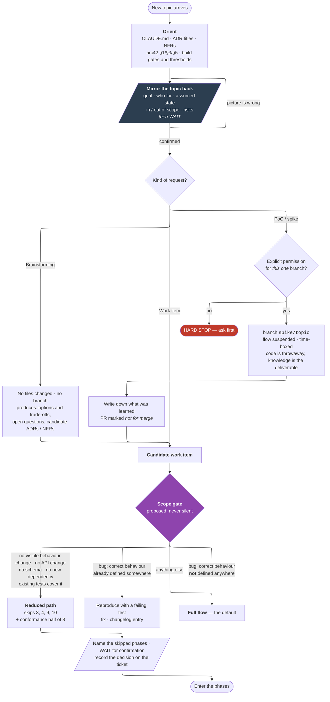
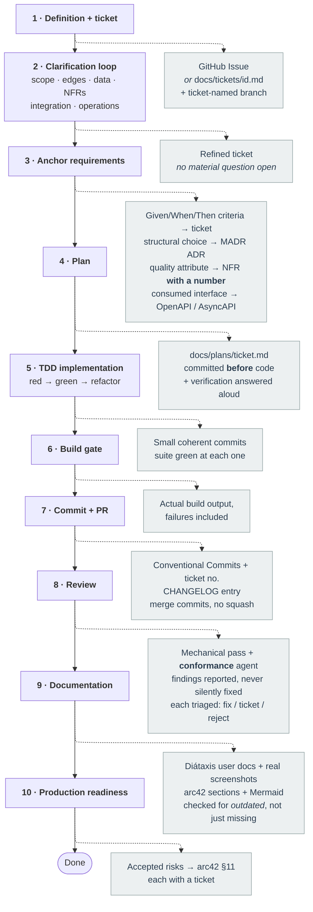
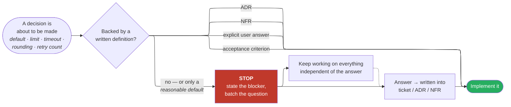
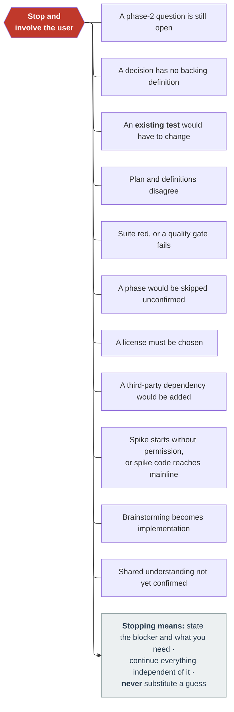
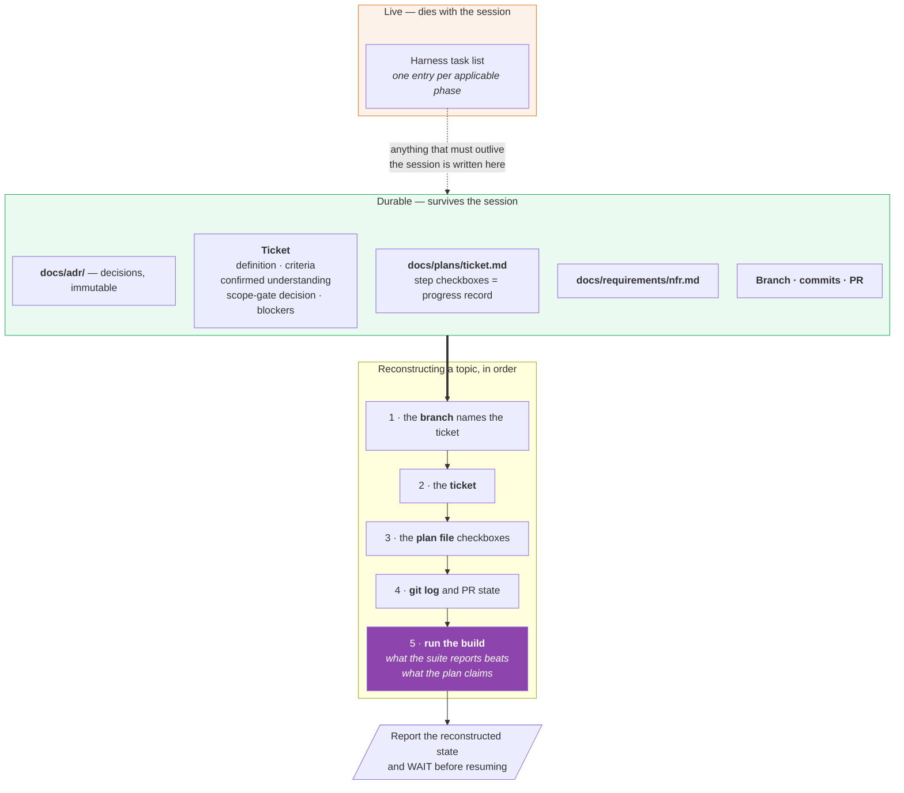
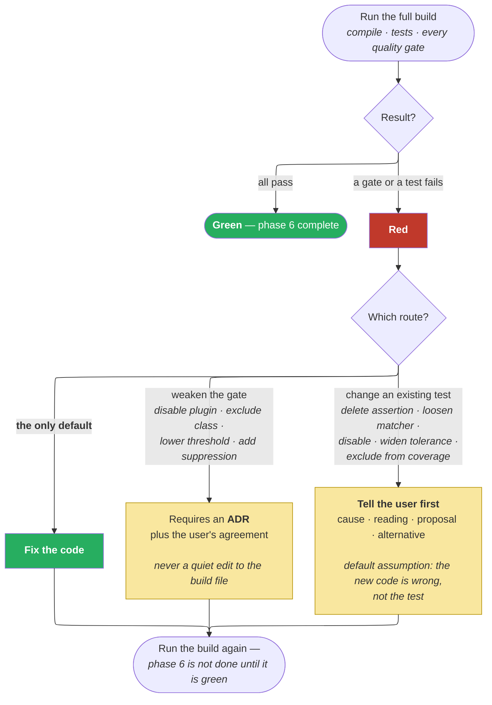
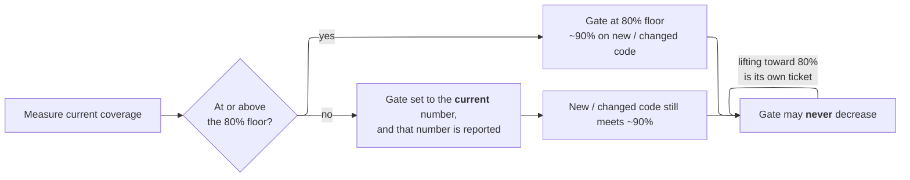
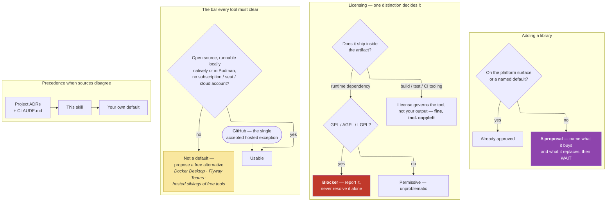
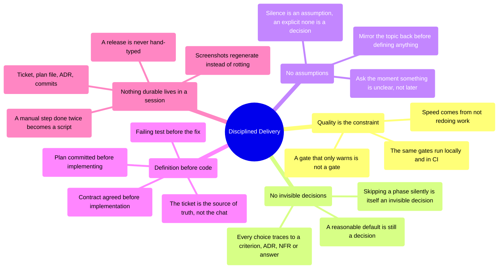

# Disciplined Delivery — the approach, visualized

Seven views of the same discipline, nine diagrams. Source is inline Mermaid so it diffs and reviews like code; the rendered PNGs live in `docs/diagrams/`, regenerated from the skill root with:

```sh
podman run --rm --userns=keep-id -v "$PWD:/data:z" docker.io/minlag/mermaid-cli \
  -i docs/delivery-flow.md -o docs/diagrams/delivery-flow.md -e png -s 3 -b white
```

The flowcharts declare `layout: elk` in their frontmatter: ELK routes edges orthogonally and minimises crossings, which the default (dagre) engine does not.

**GitHub does not register the ELK plugin**, so the fences below fall back to dagre there and render with crossings — nothing errors, it just looks worse. [`docs/diagrams/delivery-flow.md`](diagrams/delivery-flow.md) is this same document with the fences replaced by the ELK-rendered images, and is the one to open on GitHub.

---

## 1. End to end: from a topic to a routed piece of work

*Take away: nothing reaches a phase number before the understanding is confirmed and the path is agreed.*



---

## 2. The ten phases and what each one leaves behind

*Take away: every phase produces a durable artifact — the phase is not "done thinking", it is "done writing".*



---

## 3. The core invariant: no invisible decisions

*Take away: this loop runs continuously underneath every phase — it is the skill, the phases are just where it shows up.*



Hard stops that trigger the same loop:



---

## 4. Where state lives, and how a session resumes

*Take away: the live task list is a view, never the record — a resumption is reconstructed from the repository and verified by running the build.*



---

## 5. Quality is the gate, not the goal

*Take away: red is always fixed in the code — the two tempting shortcuts both require the user's agreement first.*



Coverage behaves as a ratchet rather than a cliff:



---

## 6. The decision rules behind the tool choices

*Take away: precedence, the open-source bar and the copyleft split resolve most tooling questions without opening a reference file.*



---

## 7. The ideas in one picture

*Take away: five convictions generate everything above.*



> `mindmap` is a newer Mermaid diagram type and GitHub can lag Mermaid releases — verify it renders with one throwaway commit before relying on it, or fall back to a `flowchart LR`.
